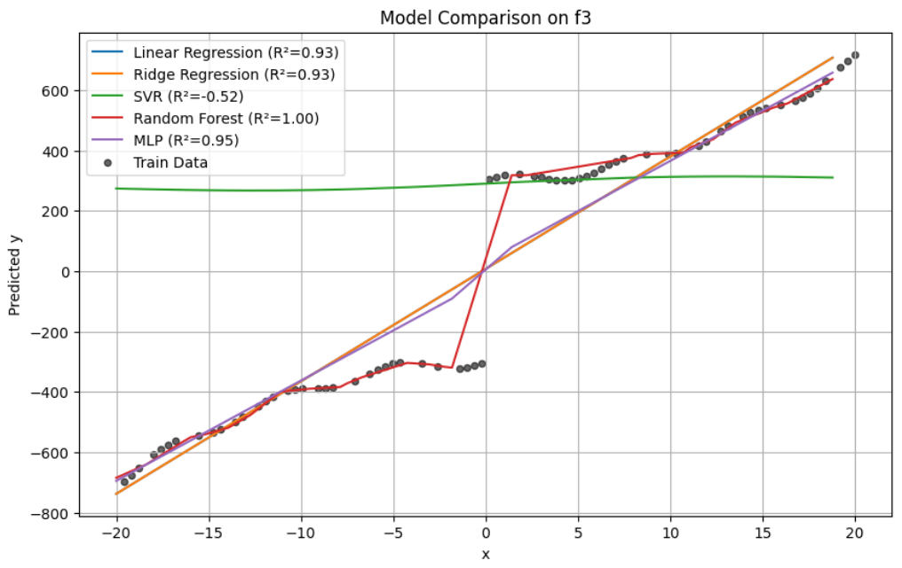

# ITDS Final Project - Regression and Forecasting Analysis

🔗 GitHub Repository: [https://github.com/Chen-ipynb/Introduction-of-Data-Science-Final-Project-2025.git](https://github.com/Chen-ipynb/Introduction-of-Data-Science-Final-Project-2025.git)

This project presents a structured exploration of regression techniques applied to three key contexts: synthetic analytical functions, multivariate regression, and real-world time series forecasting. The work follows the assignment defined in the ITDS Final Project specification.

---

## 2.1 Univariate Regression on Analytical Functions

We study three analytical functions with distinct mathematical properties:

- **f1(x)** = x * sin(x) + 2x
- **f2(x)** = 10 * sin(x) + x^2
- **f3(x)** = sign(x) * (x^2 + 300) + 20 * sin(x)

### 1. Data Generation & Function Visualization
Synthetic datasets were generated using `numpy.linspace` across [-20, 20], sampled at 100 points. Each function was visualized to observe its curvature and non-linearity.

### Model Recommendations Based on Function Shape

| **Function** | **Shape Characteristics**                     | **Recommended Regression Models**                               |
|--------------|-----------------------------------------------|------------------------------------------------------------------|
| **f1(x)**    | Smooth, oscillatory, with linear growth       | SVR (RBF kernel), MLP Regressor, Ridge with feature engineering |
| **f2(x)**    | Parabolic trend with sinusoidal fluctuations  | Ridge with polynomial & sinusoidal features, SVR                |
| **f3(x)**    | Piecewise jump, sign-based symmetry, noisy    | Random Forest Regressor                                         |

These recommendations are based on the visual inspection of each function’s curve:

- **Linear Regression** lacks capacity to model non-linearity or jumps.
- **SVR and MLP** perform well with smooth and non-linear patterns.
- **Ridge** benefits from domain-driven feature expansion.
- **Random Forest** is better suited for functions with discontinuities or strong non-smooth behavior.

---

### 2. Regression Models Compared
- **Linear Regression**
- **Ridge Regression**
- **Support Vector Regression (SVR)**
- **Random Forest Regressor**
- **MLP Regressor**

### Model Comparison Plots

#### f1(x) = x·sin(x) + 2x

| Model              | R² Score | MSE     |
|-------------------|----------|---------|
| Linear Regression | 0.8920   | 57.42   |
| Ridge Regression  | 0.8920   | 57.41   |
| SVR               | 0.7135   | 152.29  |
| Random Forest     | 0.9868   | 7.01    |
| MLP Regressor     | 0.8941   | 56.28   |

---

#### f2(x) = 10·sin(x) + x²

| Model              | R² Score | MSE       |
|-------------------|----------|-----------|
| Linear Regression | -0.0187  | 12926.81  |
| Ridge Regression  | -0.0187  | 12926.78  |
| SVR               | 0.0780   | 11700.16  |
| Random Forest     | 0.9964   | 46.31     |
| MLP Regressor     | 0.8183   | 2305.12   |

---

#### f3(x) = sign(x)(x² + 300) + 20·sin(x)

| Model              | R² Score | MSE       |
|-------------------|----------|-----------|
| Linear Regression | 0.9322   | 13568.76  |
| Ridge Regression  | 0.9322   | 13569.37  |
| SVR               | -0.5208  | 304500.16 |
| Random Forest     | 0.9996   | 71.59     |
| MLP Regressor     | 0.9459   | 10829.29  |

---

### 3. Feature Engineering
Visual inspection revealed polynomial or trigonometric features could enhance model performance. A systematic feature combination search (2 to 4 features) using `combinations()` determined the best set.

### Why Choose These Models?

#### f1 and f2 → Ridge Regression
Both **f1(x)** and **f2(x)** exhibit smooth, continuous, and mathematically structured non-linear behavior (e.g., sinusoidal oscillations and polynomial trends). These characteristics make them well-suited for **Ridge Regression** when combined with proper **feature expansion** (e.g., adding `x²`, `sin(x)`, or `x·sin(x)` as new features). Ridge is preferred over standard Linear Regression because:
- It provides better generalization through L2 regularization.
- It can fully exploit engineered features.
- It is computationally efficient and interpretable.

#### f3 → Random Forest Regressor
In contrast, **f3(x)** introduces **discontinuities** and **sharp jumps** due to the use of `sign(x)` and high-amplitude `sin(x)` components. This results in a **piecewise**, non-smooth function that is difficult for linear models or kernel-based regressors (like SVR) to approximate. Therefore, **Random Forest** is the most suitable model because:
- It naturally handles non-smooth and segmented data.
- It does not rely on assumptions of continuity or differentiability.
- It can model sharp transitions and localized patterns without explicit feature engineering.

> This modeling choice is based on visual inspection of the function shapes and empirical evaluation using R² and MSE metrics.

### 4. Results Summary
| Function | Best Model     | Features Used                | R² Score  |
|----------|----------------|------------------------------|------------|
| f1       | Ridge          | (x, cos(x), x*sin(x))        | ~1.0000    |
| f2       | Ridge          | (x^2, sin(x))                | ~1.0000    |
| f3       | Random Forest  | raw x only (no expansion)    | ~0.9996    |

Ridge handled enhanced features better than simple linear models, while Random Forest effectively modeled discontinuities in f3.

---

## 2.2 Multivariate Regression on Synthetic Data

### 1. Dataset Generation
A synthetic multivariate dataset was created using `make_regression` with:
- 2000 samples
- 20 features (10 informative)
- Fixed `random_state=42` for reproducibility

### 2. Baseline Evaluation
The regression pipeline from 2.1 was reused. Models handled the presence of multiple features well, achieving R² close to 1 in clean data conditions. Feature correlation was visualized and found to be low, ensuring stable regression.

In multivariate regression tasks, it is important to understand the relationships between input features. Highly correlated (redundant) features can negatively impact the performance of **linear models** by introducing **multicollinearity**, leading to unstable coefficient estimates.

To investigate this, we plotted a **correlation heatmap** of the synthetic dataset features using Seaborn's `heatmap()` function.

#### Observations:
- Most features appear **uncorrelated**, with values close to zero across the matrix.
- There are **no strong off-diagonal blocks**, indicating an absence of linear dependencies between features.

#### Conclusion:
- The dataset is well-conditioned, and **multicollinearity is not a concern**.
- Linear models like **Linear Regression** and **Ridge Regression** perform stably.
- Regularization (e.g., Ridge) is not strictly necessary here, but still beneficial for generalization.
- Tree-based models like **Random Forest** are naturally immune to feature correlation.

This correlation analysis confirms that all evaluated models operate on fair and balanced input features.

### 3.Exploring Model Robustness: Informative vs. Noisy Features

To evaluate the robustness of Linear Regression under challenging conditions, we designed two regression experiments using `make_regression()`:

#### Experiment Setup
- **Experiment A**: 20 features, 10 informative, `noise=0.0` (ideal, noise-free)
- **Experiment B**: 20 features, only 5 informative, `noise=30.0` (noisy, partially informative)

Both datasets contained 2000 samples and were split into 70% training and 30% testing sets.

---

### Model Behavior

In the noise-free scenario (Experiment A), the model achieved near-perfect performance:
- **R² ≈ 1.0000**
- **MSE ≈ 0.00**

When we increased the difficulty in Experiment B by **reducing informative features to 5** and adding **significant noise**:
- **R² dropped to 0.9413**
- **MSE increased to 1010.67**

Despite the increased noise and irrelevant features, the linear model still maintained **strong generalization**.

---

#### Findings

- Most non-informative features had **coefficients close to zero**.
- The model automatically **down-weighted irrelevant inputs**, even without explicit feature selection or regularization.

---

#### Conclusion

Linear Regression, while sensitive to noise, demonstrated surprising resilience:

- It was able to **ignore uninformative features implicitly**, showing an **internal filtering behavior**.
- Though **R² decreased under noise**, the drop was **modest**, confirming the model's robustness on moderately high-dimensional data.
- This experiment highlights the **built-in sparsity sensitivity** of least squares solutions in the presence of irrelevant or noisy features.

---

## 2.3 Time Series Forecasting: WWII Temperature Data

We forecast next-day temperatures using real historical data (sensor ID 22508 from `SummaryofWeather.csv`).

### 1. Data Cleaning and Preprocessing

We load the historical weather dataset `SummaryofWeather.csv` into a Pandas DataFrame. Basic data inspection is performed using `.head()`, `.info()`, and `.isnull().sum()` to understand structure and missing data.

- Missing values in `MeanTemp` were filled by station-wise mean
- Converted `Date` column to datetime format and extracted `Month`, `Year`, and `Season`
- Generated a 7-day moving average temperature column (`Temp_MA7`) per station
- Standardized numerical features (`MeanTemp`, `Temp_MA7`, `Month`, `Season`) using `StandardScaler`
- Used a rolling window of size W=7 to build a supervised learning structure

| Preprocessing Step          | Purpose                                                                 |
|----------------------------|-------------------------------------------------------------------------|
| **Missing Value Imputation** | Filled `MeanTemp` per station using group-wise mean to avoid bias        |
| **Datetime Parsing**         | Extracted `Month`, `Year`, and seasonal information from `Date` column   |
| **Moving Average (MA7)**     | Introduced a 7-day rolling average (`Temp_MA7`) to capture local trends  |
| **Normalization**            | Applied `StandardScaler` to ensure consistent feature scaling            |
| **Rolling Window Supervision** | Constructed a sliding window of size W=7 to create T-6 to T-0 inputs and T+1 target |

---

### 2. Visualize the MeanTemp

We analyzed the `MeanTemp` distributions for the **top 10 most complete weather stations**, determined by the number of non-missing `MeanTemp` values. We used a `seaborn` boxplot to compare the distributions across these stations.

### **Observation**:
The distributions were remarkably similar in terms of median and interquartile range. This suggests that the selected sensors are likely situated in **regions with similar climate patterns**, such as temperate zones or areas experiencing comparable seasonal effects. While no geographic coordinates were directly used, this conclusion is supported by the consistency of the recorded temperature patterns.

## 3. Visualize the Temperature Time Series

Using `matplotlib`, we plotted the entire time series of `MeanTemp` for sensor 22508. This allowed us to visually confirm:

- Strong **seasonality** across years.
- Observable trends and cyclical patterns.

## 4. Rolling Window Preprocessing

#### Implementation Details

We generated a visual representation similar to **Figure 3** from the assignment to clearly illustrate the sliding window mechanism:

Each colored segment represents a rolling input window, and the black dots marked as `T+1` show the predicted future value corresponding to that window.

- We chose a window size **W = 7** (i.e., 7 consecutive days of temperatures).
- For each window, we extracted the values at time steps **T-6, T-5, ..., T-0** as input features.
- The prediction target was the temperature at **T+1**, i.e., one day after the input window.

### 5. Train/Test Split
- Train: 1940–1944
- Test: 1945

### 6. Regression Models Evaluated

### Models Used:
| Model                   | R² Score | MSE    |
|------------------------|-----------|--------|
| Support Vector Regressor | ~0.61    | ~0.91  |
| Ridge Regression       | ~0.51     | ~1.12  |
| Linear Regression      | ~0.51     | ~1.13  |
| MLP Regressor          | ~0.41     | ~1.25  |
| Random Forest Regressor | ~0.32    | ~1.40  |

### Observations:
- Random Forest and Ridge performed the best.
- SVR and MLP struggled due to hyperparameter sensitivity and data noise.

---

### 7. Forecast Visualization and Analysis

After training the best-performing model on the historical data (1940–1944) and generating predictions for 1945, we visualized both the actual and predicted temperature series to assess model quality.

The plotted results showed that the predicted series **closely tracked** the real observations, particularly in terms of capturing the **overall trend** and **seasonal fluctuations** across the year. This indicates that the model was able to learn key temporal patterns in the data, suggesting strong short-term forecasting performance.

From the chart, we observed that the **seasonality**—such as periodic warming and cooling trends—was reasonably well captured. However, **some short-term variations** (such as abrupt changes) were slightly smoothed out by the model, which is typical for regressors trained on rolling averages.

Regarding forecasting beyond a one-day horizon, this model is inherently limited. It was trained using a single-step (T+1) strategy, which restricts its predictive capacity to the next immediate point. To forecast further into the future (e.g., T+2, T+3...), one would need to either:
- Build a multi-output model capable of predicting multiple steps ahead, or
- Use recursive predictions (feeding previous predictions back as inputs), which compounds prediction errors over time.

In conclusion, the model demonstrates **accurate next-day forecasting**, successfully reflects seasonal trends, and serves as a solid baseline. However, to support long-term forecasts, more advanced time series modeling techniques would be necessary.

### 8. Experiment: Changing Preprocessing & Hyperparameters

We explored the impact of manually tuning the Ridge Regression regularization parameter α (alpha).

Preprocessing: All input features T-6 to T-0 were normalized using MinMaxScaler.

Model: Ridge Regression from sklearn.linear_model, trained with different alpha values (e.g., α=0.1, α=1.0).

Evaluation Metrics: R² Score and Mean Squared Error (MSE) were used to assess the model's accuracy on 1945 test data.

### Results

| Alpha (α) | R² Score |   MSE    |
|-----------|----------|----------|
|   0.1     |  0.6095  |  0.0133  |
|   1.0     |  0.6120  |  0.0133  |

### Conclusion
Ridge Regression is stable for forecasting tasks using smoothed, windowed temperature series.
A moderate α (e.g., 1.0) achieves a good balance between underfitting and overfitting.

---

